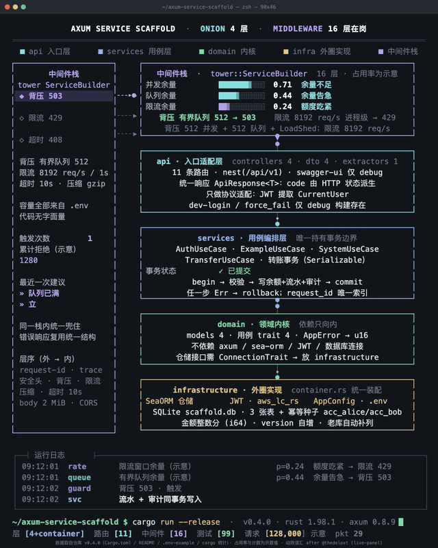

<div align="center">
  
  <h1>Axum Service Scaffold</h1>
</div>

一个面向 `axum + sea-orm` 的 Rust 空白脚手架，按 DDD + 洋葱架构组织代码。这个仓库的目标不是提供完整业务，
而是给你一个可以直接复制作为新项目基础骨架的起点：鉴权、事务、中间件、统一响应等常用能力已经内置并验证过，
clone 下来即可跑通。

保留的技术选型：

- Web 框架 `axum`、ORM `sea-orm`、鉴权 `jsonwebtoken`（`aws_lc_rs` 后端）
- OpenAPI 文档 `utoipa + swagger-ui`、密码哈希 `argon2`
- 预置 `rayon` 与一组常用库备用

## 架构动效预览

<a href="docs/live-panel/axum-service-scaffold.mp4">
  
</a>

上方 GIF 为循环播放的架构动效预览（30 秒，终端风格），点击可播放完整 mp4（1200×1500），
内容按本仓库实际代码整理：层序取自 `src/middleware/stack.rs`，路由与实体数量取自 `src/`，
容量参数取自 `.env-example`。面板配置为 `docs/live-panel/config.json`，静帧在 `docs/live-panel/frames/`。

> 面板中三条占用率 bar、触发次数、请求计数为示意值，用于展示动效；其余数字均有仓库来源。

## 架构总览

请求从进入到返回的完整路径，以及各层的依赖关系：

<div align="center">
  
</div>

脚手架采用 `api -> services -> domain -> infrastructure` 四层加装配层（`container.rs`）的洋葱架构，
依赖方向由外向内强制收紧：`domain` 不依赖 axum / sea-orm / JWT 等外部框架，`services` 只面向领域接口写用例，
`api` 只做协议适配，`infrastructure` 是可替换的外部实现。分层详解、目录结构与每层职责见
[架构设计](docs/ARCHITECTURE.md)。

## 已经内置的能力

- **洋葱架构骨架**：四层加装配层，参考实现可直接照抄扩展
- **统一响应结构**：`{code, message, data?, timestamp}`，见 [统一响应结构](docs/RESPONSE.md)
- **生产可用的中间件栈**：请求 ID / Trace / 安全响应头 / 背压 / 限流 / 超时 / Body 限制 / 压缩，
  参数集中在 `.env`，见 [中间件栈与配置](docs/MIDDLEWARE.md)
- **事务示例**：一次转账完整演示「启动事务 → 读写数据 → 提交 / 回滚」，见 [事务示例](docs/TRANSACTION.md)
- **JWT 鉴权**：调试登录与当前用户解析，OpenAPI 文档与 Swagger UI 由 `docs` feature 提供（不进 release）
- **日志**：按天滚动文件日志 + 分批落盘 + 启动配置快照，见 [日志](docs/LOGGING.md)
- **SeaORM**：连接池、连通性检查、幂等建表与种子数据、仓储适配器
- **克隆即可运行**：数据库文件不入库，首次启动自动完成建表与播种

## 文档导航

- [架构设计](docs/ARCHITECTURE.md)：洋葱架构、目录结构、每层职责
- [中间件栈与配置](docs/MIDDLEWARE.md)：执行顺序、容量参数、压测调参
- [事务示例](docs/TRANSACTION.md)：转账参考实现、回滚与幂等验证
- [统一响应结构](docs/RESPONSE.md)：响应体约定
- [日志](docs/LOGGING.md)：分批落盘、启动配置日志
- [测试与构建检查](docs/TESTING.md)：构建检查命令、黑盒测试约定
- [扩展开发](docs/DEVELOPMENT.md)：新增模块步骤、内置工具、预置依赖
- [更新日志](docs/CHANGELOG.md)

## 快速开始

### 1. 准备环境变量

复制模板：

```bash
cp .env-example .env
```

PowerShell：

```powershell
Copy-Item .env-example .env
```

默认模板使用 SQLite：

```env
DATABASE_URL=sqlite://scaffold.db?mode=rwc
```

因此可以在不额外安装 MySQL/PostgreSQL 的前提下直接启动。数据库文件（`scaffold.db`）被 `.gitignore`
排除，不入库；首次启动或首次跑测试时自动完成初始化：建表 → 补列建索引 → 播种演示账户
（`acc_alice`、`acc_bob`，各 100000 分），初始化幂等，重复启动不会重复建表或重复播种。
需要恢复到干净演示状态时，直接删除 `scaffold.db` 再启动即可。

### 2. 启动服务

```bash
cargo run
```

默认监听 `http://127.0.0.1:8080`，启用 `docs` feature 的构建（开发时 `cargo run --features docs`）可访问
`http://127.0.0.1:8080/swagger-ui` 与 `http://127.0.0.1:8080/api-doc/openapi.json`。服务收到 Ctrl-C 或 SIGTERM
后会停止接收新请求并优雅关闭。

健康检查语义：

- `/api/v1/system/health`：进程存活检查，不依赖数据库，失败时不应继续接收流量。
- `/api/v1/system/ready`：数据库就绪检查，数据库不可用时返回 `503 Service Unavailable`。

> 开发登录接口（`POST /api/v1/auth/dev-login`）仅在 debug 构建提供，release 构建不存在该入口；
> 不要在生产环境使用 `.env-example` 中的示例 JWT 密钥。

## 默认接口

- `GET /`
- `GET /api/v1/system/health`
- `GET /api/v1/system/ready`
- `POST /api/v1/auth/dev-login`（仅调试构建）
- `GET /api/v1/auth/me`
- `POST /api/v1/examples/echo`
- `GET /api/v1/examples`
- `GET /api/v1/examples/{id}`
- `POST /api/v1/transactions/dev-transfer`（仅调试构建）
- `GET /api/v1/transactions`
- `GET /api/v1/transactions/{id}`

## 备注

当前仓库还是“脚手架”，不是完整业务系统：示例模块（`examples`）以演示接口协议为主，
事务示例（`transactions`）才是落库与事务的参考实现，真实项目里你需要按业务替换账户、流水与审计表。

## 贡献指南

提交代码前请先阅读 [AGENTS.md](AGENTS.md)，它是本项目的开发规范（开发宪法），包含 Git 提交规范、
Rust CI 标准、依赖管理与版本锁定要求、DDD + 洋葱架构的项目结构约束。

仓库使用 `prek`（Rust 编写的 Git hook 管理器）管理提交前检查，钩子配置见 `.pre-commit-config.yaml`：

```bash
prek init   # 安装钩子，之后每次 git commit 自动运行格式、lint、构建与测试检查
```

所有变更必须通过以下检查后才能提交：

```bash
prek run --all-files
cargo fmt --all -- --check
cargo clippy --all-targets -- -D warnings
cargo build
cargo test
```

单元测试覆盖率使用 `cargo llvm-cov` 检测，要求不低于 80%。

## 许可证

本项目采用 [MIT OR Apache-2.0](https://opensource.org/licenses) 双许可，使用者可任选其一遵循：

- MIT 许可证全文见 [LICENSE-MIT](LICENSE-MIT)
- Apache-2.0 许可证全文见 [LICENSE-APACHE](LICENSE-APACHE)

---

<div align="center">
  <sub>Built with ❤️ by the AxumServiceScaffold team</sub>
</div>
