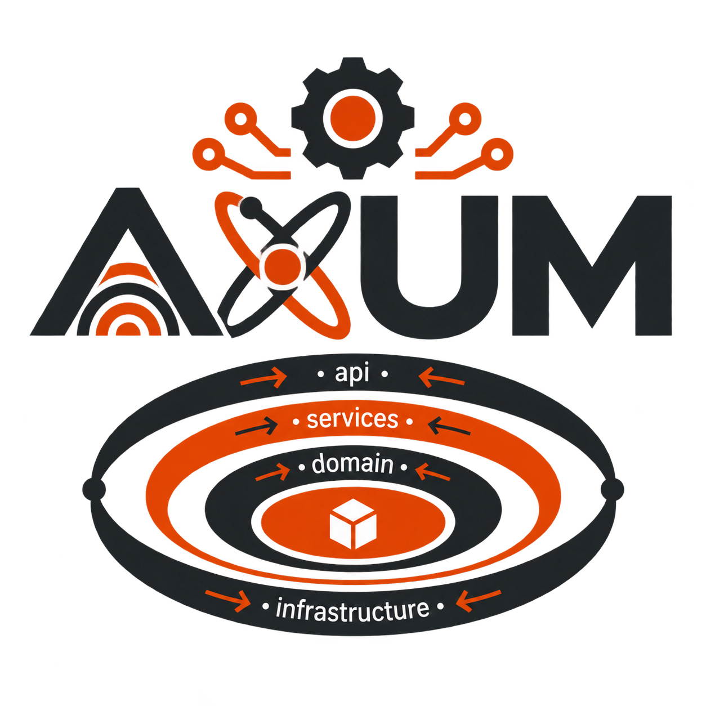
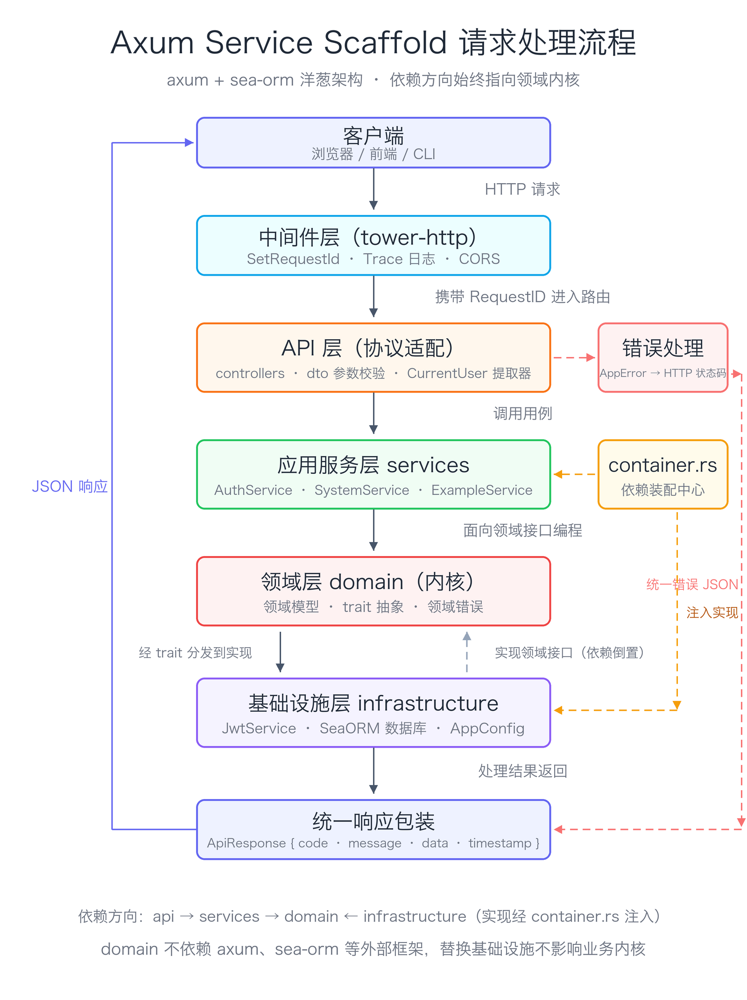

<div align="center">
  
  <h1>Axum Service Scaffold</h1>
</div>

一个面向 `axum + sea-orm` 的 Rust 空白脚手架，已经改成参考 `demo` 的洋葱架构组织方式，但保留了当前项目原本的技术选型：

- Web 框架仍然是 `axum`
- ORM 仍然是 `sea-orm`
- 鉴权仍然是 `jsonwebtoken`
- OpenAPI 仍然是 `utoipa + swagger-ui`
- 新增默认密码哈希工具 `argon2`
- 新增并预置 `rayon` 与一组常用库备用

这个仓库的目标不是提供完整业务，而是给你一个可以直接复制的新项目基础骨架。

## 为什么改成洋葱架构

这个脚手架现在采用 4 层加装配层的方式：

```text
api -> services -> domain
         |
         v
   infrastructure
```

对应目录：

```text
src
├─ api                # HTTP 入口层：路由、控制器、DTO、提取器
├─ services           # 用例实现层：组合领域规则与基础设施能力
├─ domain             # 领域内核：模型、错误、接口抽象、常量
├─ infrastructure     # 外部实现：配置、数据库、JWT、仓储适配器
├─ util               # 通用工具：如 Argon2 密码哈希
├─ container.rs       # 依赖装配中心
├─ create_app.rs      # Axum app factory
├─ error.rs           # 把领域错误映射成 HTTP 响应
├─ response.rs        # 统一 API 返回包装
├─ docs.rs            # Swagger 聚合定义
└─ main.rs            # 启动入口
```

### 对比 Java 常见的 `controller -> service -> dao`

很多 Java 项目里的 `controller/service/dao` 在小项目里上手快，但一旦业务变复杂，常见问题是：

- `service` 既管业务规则，又直接拼 ORM 查询，又顺手处理 HTTP DTO
- `dao` 很容易被上层直接拿去用，导致业务规则绕过 service
- controller 层本该只处理输入输出，最后却夹带鉴权、参数转换、异常映射
- 换数据库、换鉴权、接 MQ、接第三方 API 时，修改范围会一路渗透进业务代码

洋葱架构的优势在于依赖方向被强制收紧：

- `domain` 不依赖 `axum`、`sea-orm`、JWT 库这些外部框架
- `services` 只面向领域接口和模型写用例，不把 HTTP 层细节带进去
- `api` 只负责输入输出适配，不承载业务规则
- `infrastructure` 只是外部能力实现，未来可以替换而不改核心业务
- `container.rs` 集中装配依赖，避免到处散落“手动注入”

一句话概括：

- Java 风格三层更像“按职责分文件”
- 洋葱架构更强调“按依赖方向隔离变化”

对于脚手架来说，后者更适合长期扩展，因为你一开始就把“业务核心”和“外部框架”拆开了。

### 请求处理流程

一个请求从进入到返回的完整路径，以及各层的依赖关系：

<div align="center">
  
</div>

## 当前目录结构

```text
src
├─ api
│  ├─ controllers
│  │  ├─ auth_controller.rs
│  │  ├─ example_controller.rs
│  │  ├─ system_controller.rs
│  │  └─ transaction_controller.rs
│  ├─ dto
│  │  ├─ auth.rs
│  │  ├─ example.rs
│  │  ├─ system.rs
│  │  └─ transaction.rs
│  ├─ extractors
│  │  └─ current_user.rs
│  └─ mod.rs
├─ domain
│  ├─ models
│  │  ├─ auth.rs
│  │  ├─ example.rs
│  │  ├─ system.rs
│  │  └─ transaction.rs
│  ├─ services
│  │  ├─ auth.rs
│  │  ├─ example.rs
│  │  ├─ system.rs
│  │  └─ transaction.rs
│  ├─ constants.rs
│  ├─ error.rs
│  └─ repositories
│     └─ mod.rs            # 仅说明边界，仓储接口在 infrastructure
├─ entities
│  ├─ transfer_account.rs
│  ├─ transfer_audit.rs
│  ├─ transfer_record.rs
│  └─ mod.rs
├─ infrastructure
│  ├─ databases
│  │  ├─ mod.rs
│  │  └─ schema.rs         # 建表与幂等种子数据
│  ├─ repositories
│  │  ├─ mod.rs
│  │  └─ transaction.rs    # 转账仓储接口 + SeaORM 实现
│  ├─ services
│  │  └─ jwt.rs
│  ├─ config.rs
│  └─ mod.rs
├─ services
│  ├─ auth.rs
│  ├─ example.rs
│  ├─ system.rs
│  └─ transaction.rs       # 事务边界所在层
├─ util
│  └─ password.rs
├─ container.rs
├─ create_app.rs
├─ docs.rs
├─ error.rs
├─ lib.rs
├─ logging.rs
├─ main.rs
└─ response.rs
```

## 每层负责什么

### 1. `api`

最外层，处理 HTTP 相关内容：

- `controllers`：接收请求、调用用例、返回统一响应
- `dto`：请求体和响应体
- `extractors`：例如 JWT 当前用户提取

这一层不做核心业务判断，只做协议适配。

### 2. `services`

应用服务层，也就是“用例实现层”。

这一层负责：

- 组织一次完整业务流程
- 调用领域接口
- 调用基础设施能力
- 保持 controller 足够薄
- **持有数据库事务边界**（`begin` → 读写 → `commit` / `rollback`）

这里可以理解成“真正写业务编排的地方”。

### 3. `domain`

最内层，定义系统核心抽象：

- 领域模型
- 领域错误
- service trait
- 常量

这里不直接依赖 `axum`、`sea-orm`、JWT 或数据库连接。

仓储接口需要引用 `sea_orm::ConnectionTrait`（否则无法在事务内复用），
因此它和实现一起放在 `infrastructure/repositories`，`domain/repositories` 只保留边界说明。

### 4. `infrastructure`

外部世界的实现层：

- 环境配置读取
- SeaORM 数据库连接、建表与种子数据
- JWT 签发与校验
- 仓储适配器（接口 + SeaORM 实现）

这层是最容易变化的地方，所以应该被隔离在外圈。

### 5. `container.rs`

整个项目的依赖装配中心。当前默认装配：

- `SystemUseCase`
- `AuthUseCase`
- `ExampleUseCase`
- `TransferUseCase`
- `AppConfig`
- `SeaORM DatabaseConnection`
- `JwtService`

后续接 Redis、邮件、对象存储、MQ，也建议继续在这里统一装配。

## 当前已经内置的能力

### 基础设施

- `SeaORM` 数据库连接与连通性检查
- 事务示例的建表与幂等种子数据（`acc_alice`、`acc_bob`）
- `JWT` 调试登录与当前用户解析
- `Swagger UI`
- `Tracing` 请求日志
- 统一错误响应
- 统一 API 返回结构

### 统一响应结构

所有带响应体的接口共用同一结构：

```json
{
  "code": 200,
  "message": "成功",
  "data": {},
  "timestamp": 1713179523000
}
```

约定：

- `code` 由 HTTP 状态码派生，二者永远一致。`ApiResponse` 内部只保存 `StatusCode` 这一份真值，序列化时才写出 `code`。
- `data` 为空时该字段不会出现在 JSON 中。
- `timestamp` 为毫秒级本地时间戳。
- 需要非 200 语义（例如 `201 Created`）时使用 `ApiResponse::with_status(StatusCode::CREATED, ...)`。
- `204 No Content` 这类不带响应体的状态码不属于 `ApiResponse` 的职责，由 handler 直接返回 `StatusCode`。

### 事务示例：启动事务 → 读写数据 → 提交事务

一次转账完整演示了事务的正确用法，是新增业务模块时最值得照抄的部分：

```text
services/transaction.rs
  begin_with_config(Serializable)
    ├─ 读：查询转出/转入账户余额（事务内）
    ├─ 校验：账户存在、非同一账户、金额 > 0、余额充足
    ├─ 写：扣减转出余额、增加转入余额、写流水、写审计日志
    └─ 任一环节失败 → rollback（以上写入全部撤销）
  commit
```

接口：

| 方法 | 路径 | 说明 |
| --- | --- | --- |
| `POST` | `/api/v1/transactions/dev-transfer` | 执行转账事务，仅调试构建注册 |
| `GET` | `/api/v1/transactions/{id}` | 流水详情 + 同一事务写入的审计日志 |
| `GET` | `/api/v1/transactions` | 流水分页（`page`、`size`，`size` 上限 100） |

调试构建下的完整调用流程：

```bash
TOKEN=$(curl -s -X POST http://127.0.0.1:8080/api/v1/auth/dev-login \
  -H 'Content-Type: application/json' \
  -d '{"username":"demo-admin"}' | python3 -c 'import json,sys; print(json.load(sys.stdin)["data"]["access_token"])')

curl -s -X POST http://127.0.0.1:8080/api/v1/transactions/dev-transfer \
  -H "Authorization: Bearer $TOKEN" -H 'Content-Type: application/json' \
  -d '{"from_account_id":"acc_alice","to_account_id":"acc_bob","amount_cents":25000,
       "remark":"示例转账","request_id":"req-20260927-0001"}'
```

响应（`data` 部分）：

```json
{
  "record_id": "019680cc-7e1c-7ec0-b7b8-4b4f8e9dff10",
  "request_id": "req-20260927-0001",
  "from_account_id": "acc_alice",
  "to_account_id": "acc_bob",
  "amount_cents": 25000,
  "from_balance_after_cents": 75000,
  "to_balance_after_cents": 125000,
  "committed": true,
  "rolled_back": false
}
```

查询流水与审计日志：

```bash
curl -s "http://127.0.0.1:8080/api/v1/transactions?page=1&size=10" -H "Authorization: Bearer $TOKEN"
curl -s "http://127.0.0.1:8080/api/v1/transactions/<record_id>" -H "Authorization: Bearer $TOKEN"
```

约定：

- **事务边界只出现在 `services` 层**：`TransferService::transfer` 是唯一调用 `begin` / `commit` / `rollback` 的地方，仓储与 controller 都不开事务。
- **仓储方法接收 `C: ConnectionTrait`**：传入 `&DatabaseConnection` 表示不进事务，传入 `&DatabaseTransaction` 表示在调用方事务内执行，同一套方法两处复用。
- **写入全部完成后才提交**：任何一步返回 `Err` 都会回滚，包括余额不足这类业务错误。
- **金额用整数分**：`amount_cents: i64`，不使用浮点；账户表用自增 `version` 暴露并发丢失更新。
- **并发安全**：事务以 `IsolationLevel::Serializable` 开启（SQLite 下即 `BEGIN IMMEDIATE`），避免「先读余额再扣减」的写偏斜。
- **幂等键 `request_id`**：可选。传入时写入 `transfer_records.request_id`（唯一索引），重复提交会命中约束冲突并返回 `409 Conflict`，事务内已完成的余额更新与审计写入一起回滚。

验证回滚是否真的生效（调试构建）：

```bash
# 在事务内写入全部完成后主动失败，接口返回 500
curl -s -X POST http://127.0.0.1:8080/api/v1/transactions/dev-transfer \
  -H "Authorization: Bearer $TOKEN" -H 'Content-Type: application/json' \
  -d '{"from_account_id":"acc_alice","to_account_id":"acc_bob","amount_cents":30000,"force_fail":true}'

# 流水分页仍为 0，余额也未被改动，说明事务内写入全部被撤销
curl -s "http://127.0.0.1:8080/api/v1/transactions" -H "Authorization: Bearer $TOKEN"
```

`force_fail` 字段与 `/dev-transfer` 路由都只在 debug 构建存在，release 构建下不存在该入口。

验证唯一约束冲突是否会留下半截数据：

```bash
# 首次提交成功，Alice 余额 100000 -> 80000
curl -s -X POST http://127.0.0.1:8080/api/v1/transactions/dev-transfer \
  -H "Authorization: Bearer $TOKEN" -H 'Content-Type: application/json' \
  -d '{"from_account_id":"acc_alice","to_account_id":"acc_bob","amount_cents":20000,"request_id":"req-dup-1"}'

# 换金额但复用同一个幂等键：约束冲突发生在余额更新之后，接口返回 409
curl -s -X POST http://127.0.0.1:8080/api/v1/transactions/dev-transfer \
  -H "Authorization: Bearer $TOKEN" -H 'Content-Type: application/json' \
  -d '{"from_account_id":"acc_alice","to_account_id":"acc_bob","amount_cents":5000,"request_id":"req-dup-1"}'

# 流水仍只有 1 条，Alice 余额仍是 80000：第二次的写入被整体回滚
curl -s "http://127.0.0.1:8080/api/v1/transactions" -H "Authorization: Bearer $TOKEN"
```

这也是「跨表写入必须放在一个事务里」的直接证据：约束冲突不会只回滚失败的那一步。

### 默认示例接口

- `GET /`
- `GET /api/v1/system/health`
- `GET /api/v1/system/ready`
- `POST /api/v1/auth/dev-login`
- `GET /api/v1/auth/me`
- `POST /api/v1/examples/echo`
- `GET /api/v1/examples`
- `GET /api/v1/examples/{id}`
- `POST /api/v1/transactions/dev-transfer`（仅调试构建）
- `GET /api/v1/transactions`
- `GET /api/v1/transactions/{id}`

### 新增工具

- `src/util/password.rs`
  - `hash_password`
  - `verify_password`
- 默认密码算法：`argon2`

示例：

```rust
use axum_service_scaffold::util::password::{hash_password, verify_password};

let hashed = hash_password("S3cure-Password!")?;
let ok = verify_password("S3cure-Password!", &hashed)?;
```

## 预置备用依赖

为了让新项目开箱更快，`Cargo.toml` 里额外预置了几类常用依赖，并且加了中文分类注释：

- `argon2`：密码哈希
- `rayon`：CPU 密集型并行计算备用
- `reqwest`：对外 HTTP 调用
- `validator`：请求参数校验
- `regex`、`base64`、`once_cell`、`rand`：常用工具库

这些库暂时不一定全部在业务里直接使用，但作为脚手架是合理的储备。

## 快速开始

### 1. 准备环境变量

复制模板：

```bash
cp .env-public .env
```

PowerShell：

```powershell
Copy-Item .env-public .env
```

默认模板使用 SQLite：

```env
DATABASE_URL=sqlite://scaffold.db?mode=rwc
```

因此可以在不额外安装 MySQL/PostgreSQL 的前提下直接启动。

### 2. 启动服务

```bash
cargo run
```

开发登录接口仅在 debug 构建中提供：

```text
POST /api/v1/auth/dev-login
```

不要在生产环境使用 `.env-public` 中的示例 JWT 密钥；生产构建不会暴露调试登录接口。

健康检查语义：

- `/api/v1/system/health`：进程存活检查，不依赖数据库，失败时不应继续接收流量。
- `/api/v1/system/ready`：数据库就绪检查，数据库不可用时返回 `503 Service Unavailable`。

服务收到 Ctrl-C 或 SIGTERM 后会停止接收新请求并优雅关闭。

默认监听：

- `http://127.0.0.1:8080`

### 3. 打开 Swagger

调试构建下可访问：

- `http://127.0.0.1:8080/swagger-ui`
- `http://127.0.0.1:8080/api-doc/openapi.json`

## 数据库文件与克隆即可运行

数据库文件（`scaffold.db`）被 `.gitignore` 排除，不入库：

- **首次启动或首次跑测试**时自动完成初始化：建表 → 补列建索引 → 播种演示账户
  （`acc_alice`、`acc_bob`，各 100000 分），无需任何手工步骤。
- 初始化是幂等的：重复启动不会重复建表，也不会重复插入演示账户。
- 老版本数据库（无 `transfer_records.request_id` 列）启动时自动补列并建唯一索引，
  历史流水的该列为空，多个空值不触发唯一索引冲突。
- 需要恢复到干净演示状态时，直接删除 `scaffold.db` 再启动即可。

因此 `git clone` 之后直接执行 `cargo test` 或 `cargo run` 就能跑通，不依赖仓库内的二进制文件。

## 新模块建议怎么扩展

如果你要新增一个真实业务模块，建议按下面的顺序：

1. 先在 `domain/models` 定义领域模型
2. 在 `domain/services` 定义用例接口（仓储接口属于外圈，不放这里）
3. 在 `entities` 新增实体，并在 `infrastructure/databases/schema.rs` 补建表语句
4. 在 `infrastructure/repositories` 写仓储接口与 SeaORM 适配器，方法接收 `C: ConnectionTrait`
5. 在 `services` 写用例实现，**需要多步写入时在 `services/transaction.rs` 里找事务写法**
6. 在 `container.rs` 注入实现
7. 最后在 `api/controllers` 和 `api/dto` 暴露 HTTP 接口，并补 `docs.rs` 的 OpenAPI 声明

这样做的好处是：

- 先定业务边界，再接具体框架
- 先写抽象，再接外部实现
- 未来替换数据库或拆微服务时，冲击面更小

## SeaORM 放在哪里

这个脚手架没有改掉 SeaORM，而是把它放回更合理的位置：

- 实体统一放在 `src/entities`
- 数据库连接、建表与种子数据在 `src/infrastructure/databases`
- 仓储接口与实现放在 `src/infrastructure/repositories`

事务也遵循同一套边界：

- **只有 `services` 层开启事务**，controller 和仓储都不管事务生命周期
- 仓储方法接收 `C: ConnectionTrait`，因此同一套方法既能用于事务内，也能用于普通查询
- 参考实现：`services/transaction.rs`（事务边界）+ `infrastructure/repositories/transaction.rs`（读写）

也就是说：

- 不把 ORM 直接塞进 controller
- 不让领域层直接依赖数据库细节
- 但也不牺牲 SeaORM 的使用体验

## 构建检查

建议执行：

```bash
cargo fmt --all -- --check
cargo clippy --all-targets --all-features -- -D warnings
cargo check --all-targets
cargo check --release
cargo test --all-features
```

这样可以同时确认：

- 调试模式下 Swagger 正常；
- 发布模式下不会暴露开发登录接口；
- 所有 feature 和 release 构建均可通过；
- 测试和 Clippy 检查通过。

应用启动时会创建 `_schema_migrations` 表，为后续版本化迁移保留入口；同时创建事务示例的三张表并
幂等播种演示账户。生产环境建议在部署阶段执行明确的迁移脚本，不要使用示例 JWT_SECRET。

回滚这类“写了一半”的行为应当有测试兜底：可参考
`services/transaction.rs` 的单测（在事务内主动失败后断言数据库无残留）与
`tests/api_tests.rs` 中的 `transfer_rolls_back_every_write_when_force_fail_is_on`。

## 备注

当前仓库还是“脚手架”，不是完整业务系统，所以：

- 示例模块（`examples`）仍以演示接口协议为主，事务示例（`transactions`）才是落库与事务的参考实现
- 事务示例是演示性质，真实项目里你需要按业务替换账户、流水与审计表
- 骨架已经调整成更适合长期扩展的形态了

## 贡献指南

提交代码前请先阅读 [AGENTS.md](AGENTS.md)，它是本项目的开发规范（开发宪法），包含：

- Git 提交规范（`<type>: <中文描述>`，每次提交对应一个逻辑变更）
- Rust CI 标准、`.rustfmt.toml` 与 `.clippy.toml` 配置
- Cargo.toml 依赖管理与版本锁定要求
- DDD + 洋葱架构的项目结构约束

所有变更必须通过以下检查后才能提交：

```bash
cargo fmt --all -- --check
cargo clippy --all-targets -- -D warnings
cargo build
cargo test
```

单元测试覆盖率使用 `cargo llvm-cov` 检测，要求不低于 80%。

## 许可证

本项目采用 [MIT OR Apache-2.0](https://opensource.org/licenses) 双许可，使用者可任选其一遵循：

- MIT 许可证全文见 [LICENSE-MIT](LICENSE-MIT)
- Apache-2.0 许可证全文见 [LICENSE-APACHE](LICENSE-APACHE)


---

<div align="center">
  <sub>Built with ❤️ by the AxumServiceScaffold team</sub>
</div>